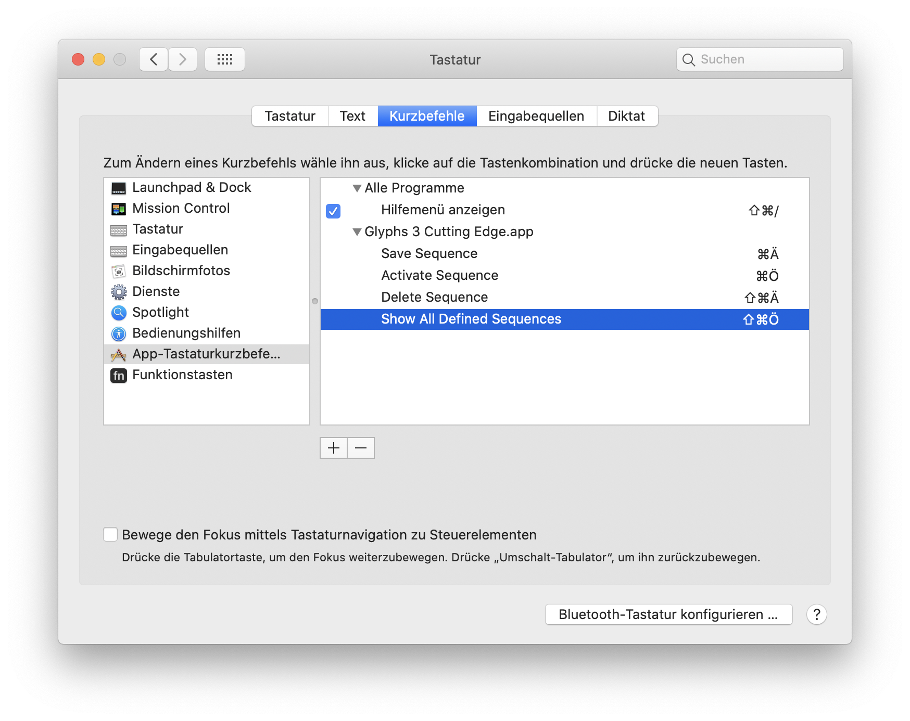

# Proof of Concept: Contextual Kerning Mode for Glyphs 3

`Warning: Code is in ALPHA stage quality. Backup your font before playing with it.`

Makeshift scriptlets to edit contextual kerning in Glyphs.app and save that into the `kern` feature.

Currently, the first middle position of a 3-glyph-sequence is processed equivalent to `pos a' b c -10;`, leaving the pre-context empty and setting the post-context to just the first glyph after the active kerning pair (cursor). Other pre and post contexts are thinkable but currently unsupported for lack of a user interface.

Both `LTR` and `RTL` directions are processed. In case of `RTL`, `IgnoreMarks` is added to the final feature code, just FYI.

Kerning classes are used when present. The kerning classes of the glyph side pointing towards the cursor is used. This currently prevents contextual kerning exceptions, again for the lack of a user interface.

## How it works

Glyphs has only one dictionary to store kerning and no facility to process contextual kerning. 

These scriptlets work around that by activating a _Contextual Kerning Mode_ where the traditional kerning UI/UX of Glyphs is hijacked to edit contextual kerning for the glyph sequence currently visible in the edit view at the cursor position. 

Then, upon saving of the contextual kerning, the contextual kerning is stored in the so-called [Tokens](https://glyphsapp.com/learn/tokens) of each font master (visible in the Masters tab of Font Info at the bottom) and the original traditional kerning is restored.

In the `kern` feature, the contextual kerning values are then accessed through the _Tokens_ by their variable name, e.g. `pos a' b c $contextualkerning;`. When generating the font, the tokens are expanded into their numeric values and interpolated between masters. This is also supported in [glyphsLib](https://github.com/googlefonts/glyphsLib).

## Usage

The usage in the following sequence needs to be repeated for each contextual kerning situation:

* ___Activate Sequence___ from menu
* Confirm feature code definition of sequence in the _Macro Panel_
* Manually adjust contextual kerning sequence across all masters
* ___Save Sequence___ from menu

Finally, you may use the scriptlet ___Generate Kern Feature___ to put the feature code into your font’s `kern` feature before generating a font. This needs to be repeated only if the amount of contextual kerning pairs has changed or if kerning class members have changed (because classes end up expanded in the feature code and that needs updating), not after you’ve adjusted individual contextual kerning values.

You can also load all stored sequences with ___Show All Defined Sequences___ and delete a sequence with ___Delete Sequence___ (after activation, as you need to confirm precisely which sequence you’re working on)

## Catch

There is currently no easy way to delete contextual kerning pairs, as they are stored as a base32-encoded string which is not straightforward to manually process. Some UI for this will happen in the future. I will probably make it so that all defined contextual kerning sequences will open in a tab, one per line, and then there will be a command to delete an activated sequence.

There is currently no support for exceptions to contextual kerning.

## Example

Below you see the the kerned contextual sequence using the feature code `pos @yeh.fina' space @kaf.init <-150 0 -150 0>` as generated by the scriptlets.

Without contextual kerning (see first word space from right):

With contextual kerning:

## Keyboard Shortcuts

For easy menu access, create yourself custom keyboard shortcuts for `Activate Contextual Kerning` and `Save Contextual Kerning` for Glyphs.app in the system preferences:

